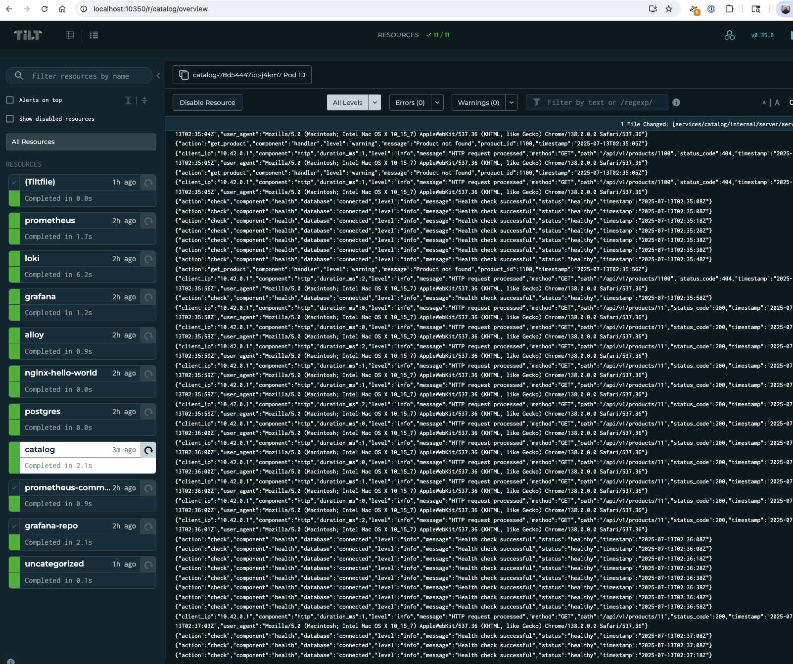

# [WIP] Kubernetes Lab
A full local Kubernetes setup with monitoring, logging and demo apps - Using k3d + Tilt

> Note: this is a work in progress



## Requirements

1. [Install Docker](https://docs.docker.com/engine/install/)
2. [Setup Docker with non-root user](https://docs.docker.com/engine/install/linux-postinstall/)
3. [Install k3d](https://k3d.io/stable/#installation)
4. [Install kubectl](https://kubernetes.io/docs/tasks/tools/#kubectl)
5. [Install Tilt](https://docs.tilt.dev/)
6. [Install Helm](https://github.com/helm/helm/releases)


## Setup

### Setup Demo apps in your hosts file

```text
127.0.0.1 nginx-hello.kubelab.lan
127.0.0.1 argus-mcp.kubelab.lan

127.0.0.1  grafana.kubelab.lan
127.0.0.1  prometheus.kubelab.lan

# Services
127.0.0.1 catalog.kubelab.lan

```

* **On macOS/Linux:** Edit `/etc/hosts` (e.g., `sudo nano /etc/hosts`).
* **On Windows:** Open Notepad **as an Administrator** and edit `C:\Windows\System32\drivers\etc\hosts`.


## Start

Run `./start-lab.sh` to start everything

## Stop / Start

After the initial setup, you can use `./tilt-lab up` or `./tilt-lab down`

> Note: note that I am using `./tilt-lab` a wrapper script instead of `tilt` command itself. 
> this is to ensure that tilt uses the appropriate kubernetes context (which should be of the k3d)
> cluster we create as part of the setup


## Access

## Using Kubectl

There is a helper script included `./kubectl-lab` that helps to make sure that we are using the
appropriate Kubernetes context at all times. This is completely optional if you know what you are doing

```bash
./kubectl-lab get all
```

### Tilt UI

You can access the Tilt UI [HERE](http://localhost:10350/)


### The deployed pods

Based on the hosts entry you have added, you can access them like this

`http://nginx-hello.kubelab.lan:8081/`

> Note: The port number 8081 comes from the fact that we set it up to use port 8081
> during k3d installation. Check the script `start-lab.sh`

### Grafana

Access at [grafana.kubelab.lan:8081](http://grafana.kubelab.lan:8081)
- Username: admin 
- Password: password or whatever you set in the grafana-values.yaml

Checkout the dashboards, metrics and logs


## What is included

### Monitoring and Logging

1. Prometheus
2. Grafana
3. Loki
4. Grafana Alloy

## Services

- [Catalog Service](./services/catalog/)

rest to come


## Simulate traffic

Run [the script](./scripts/simulate-traffic.sh) to simulate some traffic