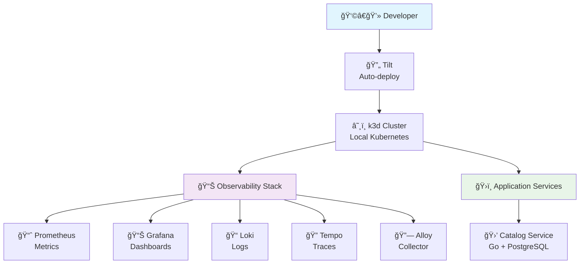

# Kubernetes Observability Lab

**Production-like observability stack in 5 minutes, locally, completely free** ⚡

Learn cloud-native observability the way you'd implement it in production - with a complete Kubernetes stack running locally using k3d + Tilt. No cloud accounts, no costs, no complexity.

Perfect for **DevOps engineers**, **SREs**, and **developers** who want hands-on experience with modern observability patterns.

---

## ⚡ Quick Start (Returning Users)

**Requirements:** Docker, k3d, kubectl, Tilt, Helm

```bash
# 1. Start the lab
./start-lab.sh

# 2. Deploy everything  
./tilt-lab up
```

**Access:** Add to `/etc/hosts` then visit [grafana.kubelab.lan:8081](http://grafana.kubelab.lan:8081) (admin/password)
Check the `Host configuration` section below for all the hosts to add to the hosts file

---

## 🎯 What You'll Build

A **complete observability stack** using production patterns, optimized for local learning:

> **Production Patterns, Local Scale**: This setup mirrors real-world observability architecture and configurations, but scaled down to run efficiently on your laptop. Perfect for learning without the complexity or cost of cloud infrastructure.

✅ **Distributed Tracing** - See request flows across microservices  
✅ **Structured Logging** - JSON logs with trace correlation  
✅ **Metrics & Dashboards** - Prometheus + Grafana monitoring  
✅ **Real Microservice** - Go catalog API (more services to come) with full instrumentation  
✅ **Traffic Simulation** - Generate realistic observability data  

**Learning Focus:** Hands-on experience with production patterns, not toy examples.

---

## 🏗️ Architecture

### Lab Infrastructure


### Service Architecture (Current + Future)

```mermaid
graph LR
    Client[🌐 Client] --> LB[⚖️ Load Balancer<br/>k3d ingress]
    LB --> Catalog[🛒 Catalog Service<br/>✅ Implemented]
    LB -.-> Cart[🛍️ Cart Service<br/>🔮 Future Phase]
    LB -.-> Orders[📦 Orders Service<br/>🔮 Future Phase]
    LB -.-> Users[👤 User Service<br/>🔮 Future Phase]
    
    Catalog --> CatalogDB[(🗄️ PostgreSQL<br/>Products)]
    Cart -.-> CartDB[(📦 Redis<br/>Sessions)]
    Orders -.-> OrdersDB[(🗄️ PostgreSQL<br/>Transactions)]
    
    subgraph "📊 Observability Pipeline"
        Traces[🔍 Distributed Traces]
        Logs[📝 Structured Logs] 
        Metrics[📈 Custom Metrics]
    end
    
    Catalog --> Traces
    Catalog --> Logs  
    Catalog --> Metrics
    
    style Catalog fill:#c8e6c9
    style Cart fill:#ffecb3
    style Orders fill:#ffecb3
    style Users fill:#ffecb3
```


---

## 🚀 Detailed Setup

### Prerequisites

| Tool | Purpose | Install |
|------|---------|---------|
| [Docker](https://docs.docker.com/engine/install/) | Container runtime | Required |
| [k3d](https://k3d.io/stable/#installation) | Local Kubernetes | Required |
| [kubectl](https://kubernetes.io/docs/tasks/tools/#kubectl) | Kubernetes CLI | Required |
| [Tilt](https://docs.tilt.dev/) | Auto-deployment | Required |
| [Helm](https://github.com/helm/helm/releases) | Package manager | Required |

### Host Configuration

Add these entries to your `/etc/hosts` file:

```bash
# Observability Stack
127.0.0.1 grafana.kubelab.lan
127.0.0.1 prometheus.kubelab.lan
127.0.0.1 tempo.kubelab.lan

# Application Services  
127.0.0.1 catalog.kubelab.lan

# Demo Apps
127.0.0.1 nginx-hello.kubelab.lan
```

**Platform-specific:**
- **macOS/Linux:** `sudo nano /etc/hosts`
- **Windows:** Edit `C:\Windows\System32\drivers\etc\hosts` as Administrator

### Launch the Lab

```bash
# Start k3d cluster and basic setup
./start-lab.sh

# Deploy the complete observability stack
./tilt-lab up
```

**What happens:**
1. Creates local Kubernetes cluster with k3d
2. Configures ingress for local domain access
3. Deploys Prometheus, Grafana, Loki, Tempo via Helm
4. Builds and deploys the catalog microservice
5. Sets up traffic simulation

---

## 🔍 Explore the Lab

### 📊 Observability Stack

| Component | Access | Purpose |
|-----------|--------|---------|
| **Grafana** | [grafana.kubelab.lan:8081](http://grafana.kubelab.lan:8081) | Dashboards, explore traces/logs/metrics |
| **Prometheus** | [prometheus.kubelab.lan:8081](http://prometheus.kubelab.lan:8081) | Metrics collection and queries |
| **Tempo** | [tempo.kubelab.lan:8081](http://tempo.kubelab.lan:8081) | Distributed tracing backend |
| **Tilt UI** | [localhost:10350](http://localhost:10350/) | Deployment management |

**Credentials:** admin / password

### 🛍️ Application Services

| Service | Access | Documentation |
|---------|--------|---------------|
| **Catalog API** | [catalog.kubelab.lan:8081](http://catalog.kubelab.lan:8081) | [Full API docs →](./services/catalog/) |
| **Demo App** | [nginx-hello.kubelab.lan:8081](http://nginx-hello.kubelab.lan:8081) | Simple test service |

### 🛠️ Helper Scripts

```bash
# Use lab-specific kubectl (ensures correct context)
./kubectl-lab get pods -A

# Generate realistic traffic for observability data
./scripts/simulate-traffic.sh

# Stop/start the lab
./tilt-lab down
./tilt-lab up
```

---

## 📚 Learning Resources

### 🎓 Progressive Learning Path

**Phase System:** Use git tags to explore different complexity levels:

```bash
# See all available phases
git tag | grep -E "^v[0-9]"

# Example: Start with monitoring basics
git checkout v1.0.0-monitoring-foundation

# Progress to distributed tracing  
git checkout v2.3.0-distributed-tracing
```

[**📖 View all phases and releases →**](https://github.com/mansoormajeed/kubernetes-lab/releases)

### 🏗️ Service Deep Dives

- **[Catalog Service →](./services/catalog/)** - Complete microservice with observability
- **[Traffic Simulation →](./scripts/)** - Generate realistic e-commerce patterns

### 🔧 Customization

- **Helm Values:** Modify `k8s/observability/*-values.yaml` 
- **Service Config:** Edit `k8s/apps/*/` deployments
- **Add Services:** Follow catalog service pattern

---

## 🚀 Traffic Simulation

Generate realistic observability data:

```bash
# Quick test with realistic e-commerce patterns
./scripts/simulate-traffic.sh --duration 300 --interval 2

# Heavy load for observability testing
./scripts/simulate-traffic.sh --duration 600 --interval 1 --verbose

# Seed database with sample products only
./scripts/simulate-traffic.sh --seed-only
```

**Generates:** Rich traces, correlated logs, realistic metrics perfect for learning observability patterns.

---

## 🤖 Built with AI Assistance

This project extensively used **AI pair programming** with Cursor/Claude. Here are key learnings for others using LLMs for infrastructure work:

### ✅ What Works Incredibly Well

1. **📖 Documentation & Code Review** - LLMs excel at reading existing code and writing comprehensive docs
2. **🏗️ Boilerplate Generation** - Perfect for repetitive Kubernetes manifests, Go handlers, etc.
3. **🔍 Architecture Analysis** - Great at suggesting improvements and identifying patterns
4. **🐛 Debugging Assistance** - Excellent at analyzing error logs and suggesting fixes

### ⚠️ Important Caveats

1. **📦 Don't Let LLMs Manage Dependencies**
   - Always check official docs for latest versions
   - Use proper tools (`go get`, `helm repo add`) instead of LLM suggestions
   - LLM knowledge of versions is often outdated

2. **🧪 Always Verify Generated Configs**
   - Test Kubernetes manifests in isolation
   - Validate Helm values against chart documentation  
   - Check that environment variables actually exist

3. **🔗 Integration Points Need Human Review**
   - Service discovery, networking, RBAC policies
   - OpenTelemetry configuration and endpoints
   - Database connection strings and credentials

### 💡 Pro Tips for AI-Assisted Infrastructure

- **Ask for comprehensive code reviews** of your entire setup
- **Use AI to explain complex error messages** (especially Kubernetes events)
- **Generate test scenarios** for validating your observability setup
- **Document architecture decisions** with AI help, but verify technical accuracy

**Result:** This approach enabled rapid development of production-like patterns while maintaining code quality and learning value.

---

## 🤝 Contributing

- 🐛 **Found a bug?** Open an issue with details
- 💡 **Have an idea?** Suggest new learning scenarios  
- 🔧 **Want to add a service?** Follow the catalog service pattern
- 📚 **Improve docs?** All improvements welcome

**Learning Focus:** Contributions should maintain educational value and production-like patterns.

---

**🎉 Ready to explore production observability?** Start with `./start-lab.sh` and dive into the Grafana dashboards!

