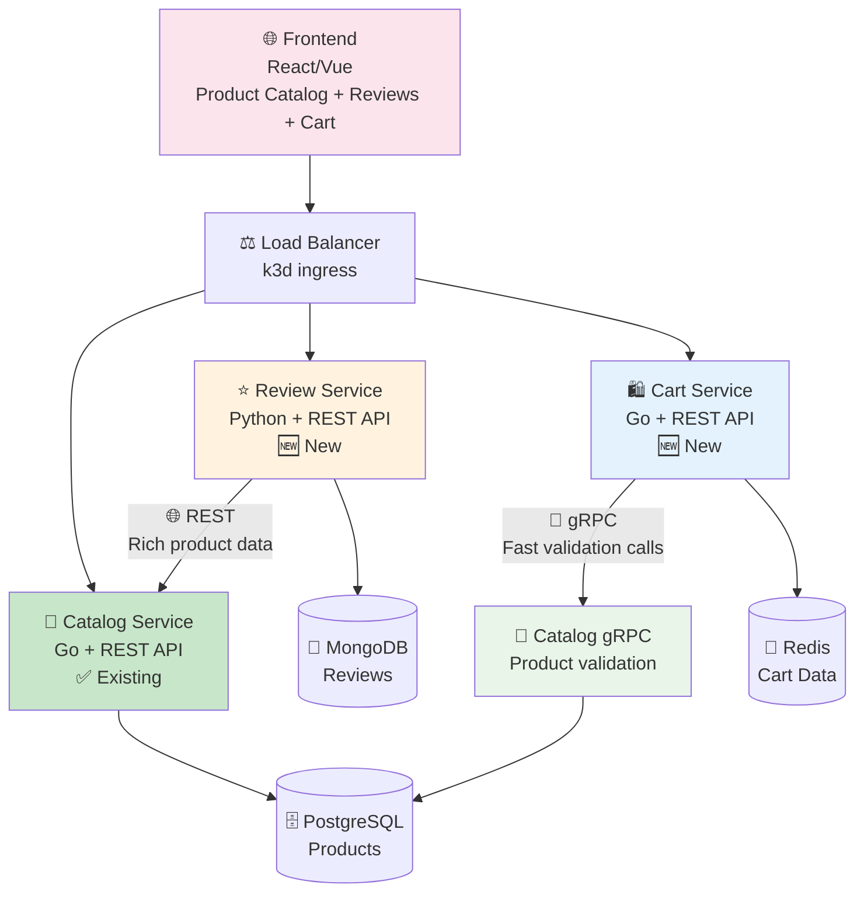

# Brainstorm docs

This folder contains bunch of brainstorm ideas on how to build this local infrastructure.
I have used several LLMs in some brainstorming sessions to design a realistic microservices architecture.

## 🛒 Business Concept: "LocalMart" E-commerce Platform

**Goal**: Build a realistic microservices architecture that mimics a modern e-commerce business - something concrete that everyone can immediately understand and relate to.

### Why E-commerce?
- **Universally understood** - Everyone has shopped online
- **Clear user journey** - Browse → Add to Cart → Checkout → Track Order → Review
- **Rich business logic** - Inventory, pricing, payments, shipping
- **Realistic data relationships** - Products, Users, Orders, Reviews
- **Immediate visual feedback** - You can actually "shop" and see the system working

### Core User Flows
1. **Product Discovery**: Browse categories, search, view product details
2. **Shopping**: Add to cart, modify quantities, see running total
3. **Product Reviews**: Write reviews, read ratings, see social proof
4. **Order Management**: Track status, view order history (future)
5. **Social Commerce**: Community-driven reviews and recommendations

## 🏗️ **Refined Technical Architecture** 

### **Final 4-Service Architecture**



### **Service Breakdown**

| Service | Technology | Communication | Database | Responsibility |
|---------|------------|---------------|----------|---------------|
| **🛒 Catalog Service** | Go | REST + gRPC Server | PostgreSQL | Products, categories, validation APIs |
| **⭐ Review Service** | Python/FastAPI | REST API | MongoDB | Product reviews, ratings, social features |
| **🛍️ Cart Service** | Go | REST API + gRPC Client | Redis | Shopping cart, session management |
| **🌐 Frontend** | React/Vue | HTTP/REST | - | Web interface, responsive design |

### **Database & Storage Strategy**
- **🗄️ PostgreSQL**: Structured product data, ACID compliance for catalog
- **🍃 MongoDB**: Document-based reviews with flexible schema for ratings, comments, photos
- **🔴 Redis**: High-speed cart sessions with TTL for abandoned carts

### **Communication Patterns**
- **🌐 REST APIs**: All external communication (Frontend ↔ Services)
- **🚀 gRPC Internal**: High-frequency calls (Cart → Catalog product validation)
- **📊 Mixed Protocol Observability**: Demonstrates tracing across REST + gRPC

### **Why This Tech Stack?**

**Language Diversity for Learning:**
- **🐹 Go**: High performance, excellent observability tooling (Catalog + Cart)
- **🐍 Python/FastAPI**: Async capabilities, ML-friendly for future sentiment analysis (Reviews)
- **⚛️ React/Vue**: Modern frontend with component reusability

**Database Diversity for Learning:**
- **🗄️ PostgreSQL**: Traditional relational, ACID compliance
- **🍃 MongoDB**: NoSQL document storage, flexible schemas
- **🔴 Redis**: Key-value store, caching, session management

**Communication Patterns:**
- **📡 REST**: Standard web APIs, easy debugging, HTTP semantics
- **🚀 gRPC**: High-performance internal communication, type safety
- **🔄 Service-to-Service**: Realistic microservices interaction patterns

## 📋 **Implementation Roadmap**

### **Phase 2: Foundation** ✅ **(Current - v2.2.0)**
**Status**: Complete - Single service with full observability

**What We Have:**
- ✅ **Catalog Service (Go)**: Full CRUD API with PostgreSQL
- ✅ **Complete Observability**: Prometheus, Grafana, Loki, Tempo
- ✅ **Production Patterns**: Structured logging, distributed tracing, metrics
- ✅ **Kubernetes Deployment**: Automated with Tilt

**Infrastructure:**
- ✅ PostgreSQL database
- ✅ Full observability stack (Prometheus, Grafana, Loki, Tempo)
- ✅ k3d cluster with ingress

### **Phase 3: Basic Frontend** 🎨 **(Next)**
**Goal**: Working e-commerce UI consuming existing Catalog Service

**Phase 3.0.0 - Basic UI (React/Vue):**
- [ ] **Frontend Foundation**: React/Vue application with modern tooling
- [ ] **Product Browsing**: Homepage with product grid, search, product details
- [ ] **API Integration**: Consume Catalog Service REST API
- [ ] **Frontend Observability**: Browser tracing, performance monitoring
- [ ] **Responsive Design**: Modern UI/UX patterns

**Learning Focus:**
- [ ] **Full-Stack Tracing**: Browser → Frontend → Catalog Service → Database
- [ ] **API Error Handling**: What happens when backend is down
- [ ] **Frontend Performance**: Bundle size, loading states, caching
- [ ] **Development Workflow**: Hot reload, containerization

### **Phase 4: Cart Service + UI Integration** 🛍️ **(Future)**
**Goal**: Add shopping cart functionality with high-performance gRPC

**Phase 4.0.0 - Cart Service + UI Updates:**
- [ ] **Cart Service**: Go service with Redis storage
- [ ] **gRPC Communication**: Cart → Catalog Service for fast validation
- [ ] **UI Integration**: Add cart functionality to existing frontend
- [ ] **Mixed Protocol Tracing**: REST + gRPC in same request flow
- [ ] **Performance Analysis**: Compare REST vs gRPC performance

**Learning Focus:**
- [ ] **High-Speed Storage**: Redis for session management
- [ ] **Protocol Comparison**: When to use gRPC vs REST
- [ ] **UI State Management**: Cart persistence, real-time updates
- [ ] **Service Resilience**: Graceful cart degradation

### **Phase 5: Review Service + UI Integration** ⭐ **(Future)**
**Goal**: Add review system with NoSQL patterns

**Phase 5.0.0 - Review Service + UI Updates:**
- [ ] **Review Service**: Python/FastAPI with MongoDB
- [ ] **NoSQL Patterns**: Document-based review storage with flexible schema
- [ ] **REST Communication**: Review → Catalog Service for product context
- [ ] **UI Integration**: Add review functionality to existing frontend
- [ ] **Cross-Language Observability**: Python service instrumentation

**Learning Focus:**
- [ ] **Document Database**: MongoDB queries, aggregations, indexing
- [ ] **Multi-Language Stack**: Python + Go + JavaScript coordination
- [ ] **Rich Data Modeling**: Reviews, ratings, user-generated content
- [ ] **Frontend Complexity**: Forms, validation, real-time updates

### **Phase 6: Advanced Patterns & Optimization** ✨ **(Future)**
**Goal**: Production-ready patterns and cross-service optimization

**Advanced Features:**
- [ ] **Performance Optimization**: Caching strategies, database tuning
- [ ] **Advanced Observability**: SLIs/SLOs, error budgets, alerting
- [ ] **Error Handling**: Circuit breakers, retry policies, graceful degradation
- [ ] **Real-time Features**: Live cart updates, review notifications
- [ ] **Security Patterns**: Authentication, authorization, input validation

**Learning Focus:**
- [ ] **Production Operations**: Monitoring, alerting, incident response
- [ ] **Service Mesh**: Advanced traffic management, security policies
- [ ] **Event-Driven Architecture**: Async communication patterns
- [ ] **Scalability Patterns**: Load testing, capacity planning

## 🎯 **Learning Objectives**

### **Microservices Patterns**
- ✅ **Single Service**: Complete observability in isolation (Phase 2)
- 🚀 **Service Communication**: REST and gRPC interaction patterns (Phase 3)
- 🎨 **User Experience**: Frontend integration with multiple services (Phase 4)
- 🔮 **Production Readiness**: Advanced operational patterns (Phase 5)

### **Technology Diversity**
- **Languages**: Go (performance), Python (flexibility), JavaScript (frontend)
- **Databases**: PostgreSQL (relational), MongoDB (document), Redis (cache)
- **Communication**: REST (standard), gRPC (performance), HTTP (frontend)

### **Observability Excellence**
- **Distributed Tracing**: Requests flowing across multiple services and protocols
- **Structured Logging**: Correlated logs across language boundaries
- **Metrics Collection**: Performance comparison between communication patterns
- **Real-world Debugging**: Complex microservices troubleshooting

## 🚀 **Why This Architecture is Perfect for Learning**

### **1. Realistic Business Logic** 🛍️
- Everyone understands e-commerce: products, reviews, shopping carts
- Natural service boundaries that make architectural sense
- Clear user journeys that demonstrate system interactions

### **2. Technology Diversity** 🌈
- **Multiple languages**: Go, Python, JavaScript (different paradigms)
- **Multiple databases**: SQL, NoSQL, Cache (different storage patterns)  
- **Multiple protocols**: REST, gRPC (different communication patterns)

### **3. Natural Service Communication** 🔄
- **Cart needs Catalog**: Product validation, pricing (gRPC - high frequency)
- **Reviews need Catalog**: Product context, validation (REST - rich data)
- **Frontend needs All**: Complete user experience (REST - standard web)

### **4. Progressive Complexity** 📈
- **Phase 2**: Single service mastery (current)
- **Phase 3**: Service interaction patterns (next)
- **Phase 4**: User experience integration (future)
- **Phase 5**: Production operational excellence (future)

### **5. Production Patterns** 🏭
- **Real communication needs**: Not forced technology demonstrations
- **Authentic error scenarios**: Network failures, service dependencies
- **Operational concerns**: Monitoring, debugging, performance optimization
- **Scale considerations**: When to use each communication pattern

## 📊 **Service Communication Deep Dive**

### **gRPC: Cart ↔ Catalog** ⚡
```proto
// High-frequency, simple validation calls
service CatalogService {
  rpc ValidateProduct(ProductValidationRequest) returns (ProductValidationResponse);
  rpc GetProductPrice(ProductPriceRequest) returns (ProductPriceResponse);
}
```
**Why gRPC here:**
- 🚀 **High frequency**: Every cart operation needs validation
- ⚡ **Performance critical**: Shopping cart should feel instant
- 🎯 **Simple data**: Just validation flags and basic info
- 🔄 **Type safety**: Structured requests prevent errors

### **REST: Review ↔ Catalog** 🌐
```http
# Rich product context for reviews
GET /api/internal/v1/products/123/review-context
{
  "id": "123",
  "name": "iPhone 15 Pro", 
  "description": "Latest iPhone...",
  "category": "Electronics",
  "images": [...],
  "specifications": {...}
}
```
**Why REST here:**
- 📊 **Rich data**: Reviews need complete product context
- 🔄 **Less frequent**: Reviews submitted less often than cart updates
- 🌐 **HTTP semantics**: Standard CRUD operations
- 🛠️ **Easy debugging**: JSON responses are human-readable

## 🎉 **Success Metrics**

### **Technical Achievement**
- 4 services running with full observability
- Mixed REST + gRPC communication with complete tracing
- 3 different database technologies integrated
- Frontend demonstrating complete user flows

### **Learning Achievement** 
- Understanding when to use REST vs gRPC
- Experience with multiple database paradigms
- Microservices communication and error handling
- Production-like observability across service boundaries

---

*Last updated: 2025-01-19*
*Status: Phase 3 Planning - Ready for Review Service Implementation* 