# Kubernetes Lab Learning Phases

This directory contains documentation for each learning phase of the Kubernetes Lab project. Each phase builds upon the previous one, allowing learners to progressively build their understanding of Kubernetes, observability, and cloud-native technologies.

## Learning Progression

### Phase 1: Foundation (v1.x) - Observability Stack
**Goal**: Set up a complete observability stack on Kubernetes
- **v1.0.0**: Basic k3d cluster with Prometheus + Grafana
- **v1.1.0**: Add Loki for log aggregation
- **v1.2.0**: Add Alloy for log collection
- **v1.3.0**: Custom dashboards and alerting rules

**Prerequisites**: Basic Docker and Kubernetes knowledge
**Duration**: 2-3 hours
**Key Concepts**: Kubernetes deployments, services, persistent volumes, Helm charts

### Phase 2: First Service (v2.x) - Application Observability
**Goal**: Deploy and monitor a single Go microservice
- **v2.0.0**: Deploy catalog service with basic Kubernetes resources and structured logging
- **v2.1.0**: Add Prometheus metrics to Go service
- **v2.2.0**: Add distributed tracing with OpenTelemetry and Grafana Tempo


**Prerequisites**: Phase 1 completed
**Duration**: 3-4 hours
**Key Concepts**: Application metrics, tracing, structured logging, health checks

### Phase 3: Frontend Foundation (v3.x) - Basic E-commerce UI
**Goal**: Build working e-commerce frontend consuming existing Catalog Service

**Sub-phases:**
- **v3.0.0**: ✅ **COMPLETE** - React Frontend (Product browsing, details, responsive design)


**Prerequisites**: Phase 2 completed
**Duration**: 3-4 hours
**Key Concepts**: Frontend-backend integration, API consumption, full-stack tracing, modern UI/UX patterns

### Phase 4: Cart Service + UI (v4.x) - High-Performance Shopping Cart
**Goal**: Add shopping cart with gRPC communication and integrate into existing UI

**Sub-phases:**
- **v4.0.0**: Cart Service (Go + Redis + gRPC to Catalog)
- **v4.1.0**: UI Integration (Add cart functionality to existing frontend)
- **v4.2.0**: Performance Analysis (REST vs gRPC comparison, optimization)

**Prerequisites**: Phase 3 completed
**Duration**: 4-5 hours
**Key Concepts**: gRPC communication, Redis caching, UI state management, protocol performance comparison

### Phase 5: Review Service + UI (v5.x) - NoSQL Social Features
**Goal**: Add review system with MongoDB and integrate into existing UI

**Sub-phases:**
- **v5.0.0**: Review Service (Python + MongoDB + REST to Catalog)
- **v5.1.0**: UI Integration (Add review functionality to existing frontend)
- **v5.2.0**: Cross-Language Observability (Python service monitoring)

**Prerequisites**: Phase 4 completed
**Duration**: 4-5 hours
**Key Concepts**: NoSQL patterns, document databases, multi-language stack, rich data modeling

### Phase 6: Production Patterns (v6.x) - Advanced Optimization
**Goal**: Production-ready patterns and cross-service optimization

**Prerequisites**: Phase 5 completed
**Duration**: 6-8 hours
**Key Concepts**: SLIs/SLOs, error budgets, circuit breakers, service mesh, event-driven architecture

## 🎯 Phase Progression Overview

The following diagram shows how each phase builds upon the previous one:

```mermaid
graph TB
    subgraph "Phase 1: Observability Foundation"
        P1[📊 Monitoring Stack<br/>Prometheus + Grafana + Loki]
    end
    
    subgraph "Phase 2: First Service"
        P2A[🛒 Catalog Service<br/>Go + PostgreSQL]
        P2B[📊 Full Instrumentation<br/>Metrics + Logs + Traces]
        P2A --> P2B
    end
    
    subgraph "Phase 3: Frontend Foundation"
        P3[⚛️ React Frontend<br/>Product browsing + UI/UX]
    end
    
    subgraph "Phase 4: Cart Service + UI"
        P4A[🛍️ Cart Service<br/>Go + Redis + gRPC]
        P4B[🔄 UI Integration<br/>Enhanced frontend]
        P4A --> P4B
    end
    
    subgraph "Phase 5: Review Service + UI"
        P5A[⭐ Review Service<br/>Python + MongoDB]
        P5B[🔄 UI Integration<br/>Review functionality]
        P5A --> P5B
    end
    
    subgraph "Phase 6: Production Patterns"
        P6[🏭 Advanced Patterns<br/>SLIs/SLOs + Circuit Breakers]
    end
    
    P1 --> P2A
    P2B --> P3
    P3 --> P4A
    P4B --> P5A
    P5B --> P6
    
    style P1 fill:#f3e5f5
    style P2A fill:#e8f5e8
    style P2B fill:#e8f5e8
    style P3 fill:#e3f2fd
    style P4A fill:#fff3e0
    style P4B fill:#fff3e0
    style P5A fill:#fce4ec
    style P5B fill:#fce4ec
    style P6 fill:#e1f5fe
```



**Learning Path Benefits:**
- **🎯 Progressive Complexity**: Each phase introduces new concepts without overwhelming learners
- **🔄 Iterative Enhancement**: Frontend grows with each backend service addition
- **📚 Technology Diversity**: Experience with Go, Python, React, multiple databases
- **🏭 Production Patterns**: Real-world observability and microservices patterns
- **🛠️ Full-Stack Learning**: Frontend to backend to infrastructure

## Getting Started

### Quick Start for Any Phase

1. **Clone the repository**:
   ```bash
   git clone https://github.com/mansoormajeed/kubernetes-lab.git
   cd kubernetes-lab
   ```

2. **Checkout the desired phase**:
   ```bash
   git checkout v1.0.0-monitoring-foundation  # or any other phase tag
   ```

3. **Start the lab environment**:
   ```bash
   ./setup-lab.sh
   ./tilt-lab up
   ```
   
   🎯 **Important**: Tilt handles all deployment automation. You don't need to manually run kubectl commands!

4. **Follow the phase-specific learning guide**:
   ```bash
   cat phases/phase-1/README.md
   ```

### Automation vs. Learning

**🤖 Tilt Automation**: 
- Handles all Kubernetes deployments automatically
- Manages service builds, deployments, and configurations
- Provides a unified development experience

**📚 Learning Focus**:
- Phase documentation explains **concepts** and **what's happening**
- You can explore the git tag to see **individual manifests** and understand components
- Exercises help you **interact with** and **understand** the deployed services
- No need to manually run deployment commands - focus on learning!

### Phase Navigation

- Each phase directory contains:
  - `README.md`: Detailed instructions and learning objectives
  - `SETUP.md`: Step-by-step setup instructions (future)
  - `EXERCISES.md`: Hands-on exercises to reinforce learning (future)
  - `TROUBLESHOOTING.md`: Common issues and solutions (future)

### How to Use This Repository

**🎯 For Learners**: 
- Checkout a phase tag to see what the system looked like at that point
- Use `./tilt-lab up` to automatically deploy everything
- Focus on understanding concepts, not manual deployment
- Explore the deployed services and their interactions

**🔍 For Understanding**:
- Look at the Kubernetes manifests in each phase to understand the components
- Read the source code to see how services are implemented
- Check the Tiltfile to understand the deployment automation
- Use the git diff between phases to see what changed

**📚 For Teaching**:
- Each phase has clear learning objectives and concepts
- Exercises focus on exploration and understanding
- Documentation explains the "why" behind each technology choice

## Release Management

### For Maintainers: Creating New Phase Releases

1. **Prepare the phase**:
   - Ensure all features are complete and tested
   - Update documentation in `phases/phase-X/`
   - Update main `README.md` if needed

2. **Create a pull request**:
   ```bash
   git checkout -b phase-2.1.0-prometheus-metrics
   # Make your changes
   git add .
   git commit -m "feat: add Prometheus metrics to catalog service (v2.1.0)"
   git push origin phase-2.1.0-prometheus-metrics
   ```

3. **After PR is merged, create the tag**:
   ```bash
   git checkout main
   git pull origin main
   git tag -a v2.1.0-prometheus-metrics -m "Phase 2.1.0: Add Prometheus metrics to catalog service"
   git push origin v2.1.0-prometheus-metrics
   ```

4. **Create GitHub release**:
   - Go to GitHub releases page
   - Select the tag
   - Add release notes with:
     - What's new in this phase
     - Learning objectives
     - Prerequisites
     - Estimated completion time

### For Learners: Switching Between Phases

```bash
# List available phases
git tag | grep -E 'v[0-9]+\.[0-9]+\.[0-9]+'

# Switch to a specific phase
git checkout v1.0.0-monitoring-foundation

# Always start the lab fresh after switching
./setup-lab.sh
```

## Contributing

When contributing new phases or improvements:

1. **Follow the phase structure** - Each phase should build logically on the previous
2. **Update documentation** - Ensure all phase docs are current
3. **Test thoroughly** - Each phase should work independently
4. **Consider prerequisites** - Make sure learning progression is smooth
5. **Add exercises** - Include hands-on activities to reinforce concepts

## Support

- **Issues**: Report bugs or suggestions via GitHub issues
- **Discussions**: Join conversations about learning paths and improvements
- **Documentation**: Help improve phase documentation and exercises

---

**Remember**: This is a learning environment. It's safe to experiment, break things, and start over. Each phase is designed to be independent and recoverable. 