# Phase 1: Observability Stack Foundation

**Goal**: Set up a complete observability stack on Kubernetes using k3d
**Prerequisites**: Basic Docker and Kubernetes knowledge

## Learning Objectives

By the end of this phase, you will:
- Deploy a local Kubernetes cluster using k3d (fully automated using Tilt)
- Set up Prometheus for metrics collection
- Configure Grafana for data visualization
- Deploy Loki for log aggregation
- Set up Alloy for unified telemetry collection (logs, with metrics and traces capability)


## Phase Milestones

### v1.0.0: Basic Monitoring Stack
- k3d cluster setup
- Prometheus deployment
- Grafana deployment with basic dashboards
- Ingress configuration for service access
- Loki for logs
- Grafana alloy for log aggregation


## What You'll Build

At the end of Phase 1, you'll have:

```mermaid
graph TB
    Dev[👩‍💻 Developer] --> Tilt[🔄 Tilt<br/>Auto-deploy]
    Tilt --> k3d[☸️ k3d Cluster<br/>Local Kubernetes]
    
    k3d --> Observability[📊 Observability Stack]
    
    Observability --> Prometheus[📈 Prometheus<br/>Metrics Collection]
    Observability --> Grafana[📊 Grafana<br/>Dashboards & Visualization] 
    Observability --> Loki[📝 Loki<br/>Log Aggregation]
    Observability --> Alloy[🔗 Alloy<br/>Log Collection & Processing]
    
    subgraph "🌐 Access Points"
        GrafanaUI[📊 grafana.kubelab.lan:8081]
        PrometheusUI[📈 prometheus.kubelab.lan:8081]
    end
    
    Grafana --> GrafanaUI
    Prometheus --> PrometheusUI
    
    style Dev fill:#e1f5fe
    style Observability fill:#f3e5f5
    style k3d fill:#e8f5e8
    style Tilt fill:#fff3e0
```



**Key Components:**
- **🔄 Tilt**: Automates all deployments and builds
- **☸️ k3d**: Local Kubernetes cluster running in Docker
- **📈 Prometheus**: Collects and stores time-series metrics
- **📊 Grafana**: Provides dashboards and data visualization
- **📝 Loki**: Aggregates and indexes log data
- **🔗 Alloy**: Modern telemetry collector for logs, metrics, and traces

## Key Concepts Covered

### Kubernetes Fundamentals
- **Deployments**: Stateless application management
- **Services**: Internal service discovery and load balancing
- **Ingress**: External traffic routing
- **Persistent Volumes**: Storage for stateful applications
- **Namespaces**: Resource organization and isolation

### Observability Stack
- **Prometheus**: Time-series metrics collection and storage
- **Grafana**: Data visualization and dashboards
- **Loki**: Log aggregation and querying
- **Alloy**: Modern log collection and processing

### Helm Charts
- **Package management**: Installing complex applications
- **Values files**: Customizing application configuration
- **Upgrades**: Managing application lifecycle

## Getting Started

### Prerequisites Check

Before starting, ensure you have:
- Docker installed and running
- kubectl installed
- Helm installed
- Basic understanding of YAML and Kubernetes concepts

### Quick Start

1. **Start the lab environment**:
   ```bash
   ./setup-lab.sh
   ```

2. **Let Tilt handle the deployment**:
   ```bash
   ./tilt-lab up
   ```
   
   🎯 **Note**: Tilt automatically deploys all components for this phase. You don't need to manually run kubectl commands - everything is automated!

3. **Verify everything is running**:
   ```bash
   ./kubectl-lab get pods -n monitoring
   ```

4. **Access services**:
   - Grafana: http://grafana.kubelab.lan:8081
   - Prometheus: http://prometheus.kubelab.lan:8081

### Understanding the Components

While Tilt handles the deployment automatically, you can explore the individual Kubernetes manifests to understand what's being deployed:

- **Observability stack**: `k8s/observability/`
- **Helm values**: `*-values.yaml` files
- **Tilt configuration**: `Tiltfile` (shows the deployment orchestration)

To see exactly what was deployed in this phase, explore the git tag:
```bash
git checkout v1.0.0-monitoring-foundation
ls k8s/observability/
cat k8s/observability/prometheus-values.yaml
```

## Exercises

### Exercise 1: Explore the Monitoring Stack
1. **Access Grafana dashboard** at http://grafana.kubelab.lan:8081
2. **Explore pre-built dashboards** - What metrics are already available?
3. **Check Prometheus targets** at http://prometheus.kubelab.lan:8081/targets
4. **Query metrics using PromQL** - Try `up` or `kubernetes_build_info`

### Exercise 2: Understand the Deployment
1. **Explore the Tilt UI** at http://localhost:10350
2. **Check what Tilt deployed**:
   ```bash
   ./kubectl-lab get all -n monitoring
   ```
3. **Look at the Tiltfile** to understand the deployment process
4. **Examine the Helm values** files to see how services are configured

### Exercise 3: Custom Dashboard
1. **Create a custom dashboard** in Grafana
2. **Add panels for cluster metrics** (CPU, memory, pod counts)
3. **Save and share the dashboard**

### Exercise 4: Log Analysis
1. **Generate some log entries** by accessing services
2. **Query logs in Grafana** using LogQL
3. **Create log-based alerts** for error conditions

## Troubleshooting

### Common Issues

**Cluster won't start**:
- Check if Docker is running
- Verify ports 8081 and 8080 are free
- Try: `./setup-lab.sh --reset`

**Services not accessible**:
- Check ingress controller: `./kubectl-lab get pods -n kube-system`
- Verify DNS resolution: `nslookup monitoring.kubelab.lan`
- Add entries to `/etc/hosts` if needed

**Prometheus not collecting metrics**:
- Check service discovery: `./kubectl-lab get servicemonitors -A`
- Verify Prometheus configuration: `./kubectl-lab get configmap -n monitoring`

## Next Steps

After completing Phase 1, you'll be ready for **Phase 2: First Service**, where you'll:
- Deploy a Go microservice
- Instrument it with Prometheus metrics
- Implement structured logging
- Add distributed tracing

## Resources

- [Prometheus Documentation](https://prometheus.io/docs/)
- [Grafana Documentation](https://grafana.com/docs/)
- [Loki Documentation](https://grafana.com/docs/loki/)
- [k3d Documentation](https://k3d.io/)
- [Kubernetes Documentation](https://kubernetes.io/docs/)

---

**Remember**: This is a learning environment. Feel free to experiment, break things, and start over. The beauty of local development is that you can always reset and try again! 