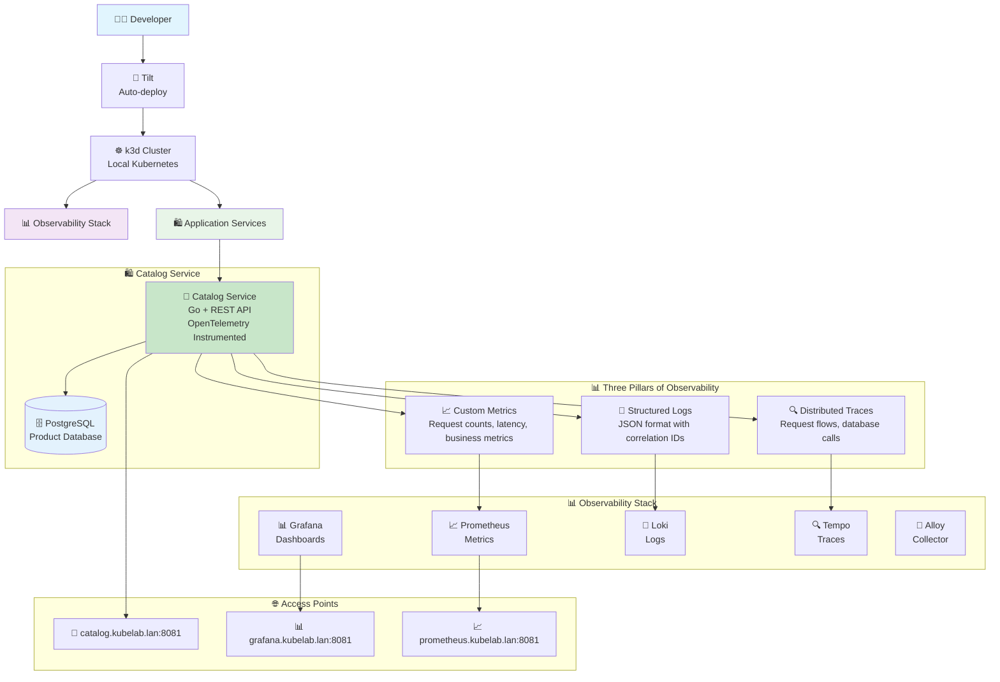

# Phase 2: First Service - Application Observability

**Goal**: Deploy and monitor a single Go microservice with comprehensive observability
**Prerequisites**: Phase 1 completed

## Learning Objectives

By the end of this phase, you will:
- Deploy a Go microservice to Kubernetes
- Configure structured logging with Loki integration
- Implement Prometheus metrics in a Go application
- Set up distributed tracing with OpenTelemetry
- Create application-specific dashboards
- Set up health checks and monitoring

## Phase Milestones

### v2.0.0: Basic Service Deployment with Structured Logging
- Deploy catalog service with Kubernetes manifests
- Configure service discovery and ingress
- Set up PostgreSQL database
- Implement basic health checks
- **Structured logging** with logrus (JSON format)
- Loki integration for log aggregation

### v2.1.0: Prometheus Metrics
- Add Prometheus metrics to Go service
- Custom application metrics (request counts, durations, business metrics)
- Service discovery integration with Prometheus
- Application-specific Grafana dashboards
- Metrics middleware for HTTP requests

### v2.2.0: Distributed Tracing
- OpenTelemetry integration in Go service
- Grafana Tempo deployment for trace storage
- Alloy configuration for trace collection
- Trace correlation across HTTP requests and database queries
- Unified observability in Grafana (metrics + logs + traces)
- TraceQL for trace querying and analysis


## What You'll Build

At the end of Phase 2, you'll have:



**Key Additions in Phase 2:**
- **🛒 Catalog Service**: Production-ready Go microservice with REST API
- **🗄️ PostgreSQL**: Relational database for product data
- **📊 Full Observability**: Metrics, logs, and traces from application code
- **🔍 OpenTelemetry**: Industry-standard instrumentation for distributed tracing
- **📈 Custom Metrics**: Business and technical metrics specific to the catalog service
- **📝 Structured Logging**: JSON-formatted logs with trace correlation

## Key Concepts Covered

### Application Observability (Three Pillars)
- **Metrics**: Custom application metrics with Prometheus
- **Logs**: Structured logging with Loki integration and correlation
- **Traces**: Request flow visibility with OpenTelemetry and Grafana Tempo
- **Correlation**: Linking metrics, logs, and traces for complete observability
- **Health Checks**: Application health monitoring

### Go Development
- **HTTP servers**: Building REST APIs
- **Database integration**: PostgreSQL with connection pooling
- **Middleware**: Logging, metrics, and tracing middleware
- **Error handling**: Proper error reporting and monitoring

### Kubernetes Application Patterns
- **ConfigMaps**: Application configuration management
- **Secrets**: Sensitive data handling
- **Ingress**: HTTP routing and load balancing
- **Service discovery**: Container-to-container communication

## Getting Started

### Prerequisites Check

Ensure you have completed Phase 1 and have:
- Working observability stack (Prometheus, Grafana, Loki)
- Basic Kubernetes knowledge
- Go development environment (optional, for code exploration)

### Quick Start

1. **Ensure Phase 1 is working**:
   ```bash
   ./kubectl-lab get pods -n monitoring
   ```

2. **Let Tilt deploy everything**:
   ```bash
   ./tilt-lab up
   ```
   
   🎯 **Note**: Tilt automatically handles the catalog service deployment, database setup, and service configuration. No manual kubectl commands needed!

3. **Verify deployment**:
   ```bash
   ./kubectl-lab get pods -n catalog
   ```

4. **Access the service**:
   - Catalog API: http://catalog.kubelab.lan:8081
   - Health check: http://catalog.kubelab.lan:8081/health

### Understanding the Service Architecture

While Tilt automates the deployment, you can explore the components to understand what's being deployed:

- **Service manifests**: `k8s/apps/catalog/`
- **Go application**: `services/catalog/`
- **Database setup**: `k8s/apps/catalog/postgres.yaml`
- **Tilt configuration**: `Tiltfile` (shows how the service is built and deployed)

To see exactly what was deployed in this phase, explore the git tag:
```bash
git checkout v2.0.0-basic-service
ls k8s/apps/catalog/
cat k8s/apps/catalog/deployment.yaml
```

## Exercises

### Exercise 1: Explore the Service
1. **Access the catalog service API** at http://catalog.kubelab.lan:8081
2. **Test the `/products` endpoint** - What data is returned?
3. **Check the health endpoint** at `/health`
4. **Explore the service logs**:
   ```bash
   ./kubectl-lab logs -n catalog -l app=catalog -f
   ```

### Exercise 2: Understand the Deployment
1. **Explore the Tilt UI** - How is the catalog service built and deployed?
2. **Check what Tilt deployed**:
   ```bash
   ./kubectl-lab get all -n catalog
   ```
3. **Look at the Go source code** in `services/catalog/`
4. **Examine the Kubernetes manifests** in `k8s/apps/catalog/`

### Exercise 3: Metrics Analysis
1. **Access Prometheus** and find catalog service metrics
2. **Create queries** for request rate and latency
3. **Build a custom Grafana dashboard** for the service
4. **Set up basic alerting** for service availability

### Exercise 4: Distributed Tracing
1. **Generate some API requests** using curl or browser
2. **Explore traces in Grafana Tempo**
3. **Correlate traces with logs**
4. **Analyze request performance**

### Exercise 5: Log Analysis
1. **Generate various log levels** by triggering different endpoints
2. **Query structured logs in Grafana** 
3. **Create log-based alerts** for error conditions
4. **Correlate logs with metrics** and traces

## Service Architecture

The catalog service demonstrates:

### API Design
- RESTful endpoints for product management
- Proper HTTP status codes
- JSON request/response format
- Error handling and validation

### Database Integration
- PostgreSQL for persistent storage
- Connection pooling for performance
- Migration support

### Observability Integration
- Prometheus metrics for business and technical metrics
- OpenTelemetry for distributed tracing
- Structured logging with correlation IDs
- Health checks for monitoring

## Troubleshooting

### Common Issues

**Service won't start**:
- Check PostgreSQL connection: `./kubectl-lab logs -n catalog -l app=postgres`
- Verify database initialization: `./kubectl-lab exec -n catalog deployment/postgres -- psql -U catalog -d catalog -c '\dt'`
- Check service configuration: `./kubectl-lab get configmap -n catalog`

**Metrics not appearing**:
- Verify service discovery: `./kubectl-lab get servicemonitor -n catalog`
- Check Prometheus targets: Access Prometheus UI and check targets
- Ensure metrics endpoint is accessible: `curl http://catalog.kubelab.lan:8081/metrics`

**Traces not visible**:
- Check Tempo deployment: `./kubectl-lab get pods -n observability`
- Verify OpenTelemetry configuration
- Ensure trace sampling is enabled

## Code Deep Dive

### Key Files to Explore

- `services/catalog/main.go`: Application entry point
- `services/catalog/internal/handlers/`: HTTP handlers
- `services/catalog/internal/server/`: Server setup with middleware
- `services/catalog/internal/logger/`: Structured logging setup
- `k8s/apps/catalog/`: Kubernetes manifests

### Instrumentation Examples

The service includes examples of:
- Custom Prometheus metrics
- OpenTelemetry trace spans
- Structured logging with fields
- Health check implementation

## Next Steps

After completing Phase 2, you'll be ready for **Phase 3: Microservices**, where you'll:
- Deploy multiple interconnected services
- Implement service-to-service communication


---

**Remember**: This phase introduces real application development concepts. Take time to understand both the Kubernetes and Go aspects of the implementation!